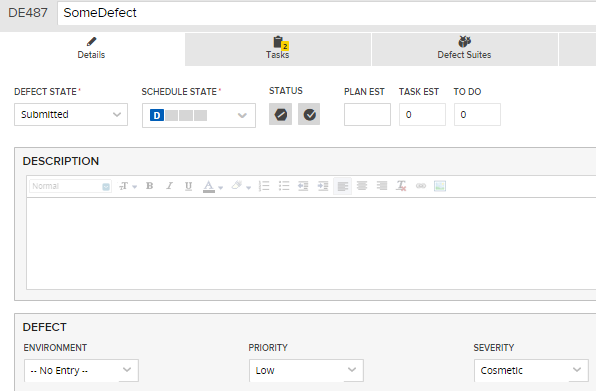
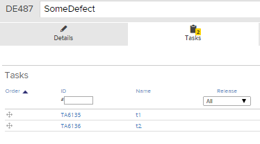
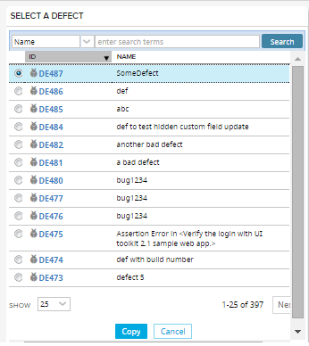
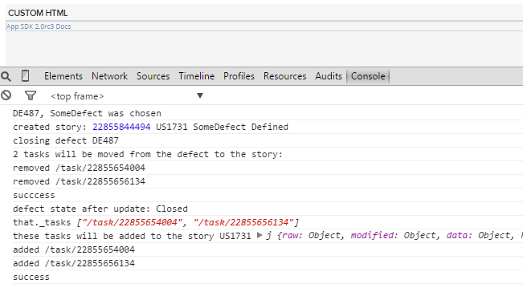
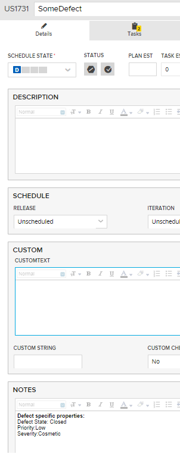
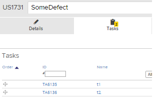
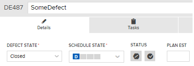

Convert Defect to Story
=========================

## Overview
This app example is a proof of concept of how to approximate "Convert Defect to User Story" functionality in the UI.
There is no feature parity between this app and how conversion is done in the UI. Here is what the app does:

1. creates a new user story with the same name.

2. sets defect's State to "Closed"

3. if there are tasks on the defect, those tasks are removed from the defect and added to the story

4. Notes field of the story is populated with some defect specific properties (State, Priority, Severity)

Here is a defect to be converted. It is currently in "Submitted" State.

It has two tasks:

Select defect to copy and click "Copy"

The debug details of the operation the console:

Details page of the new story, showing the number of tasks and Notes field

Here are the two tasks on the story:

Details page of the defect in "Closed" state. There are no tasks:

This app is vailable AS IS. It is NOT supported by Rally.

## License

AppTemplate is released under the MIT license.  See the file [LICENSE](./LICENSE) for the full text.

##Documentation for SDK

You can find the documentation on our help [site.](https://help.rallydev.com/apps/2.0rc3/doc/)
